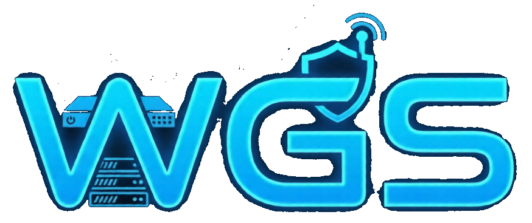
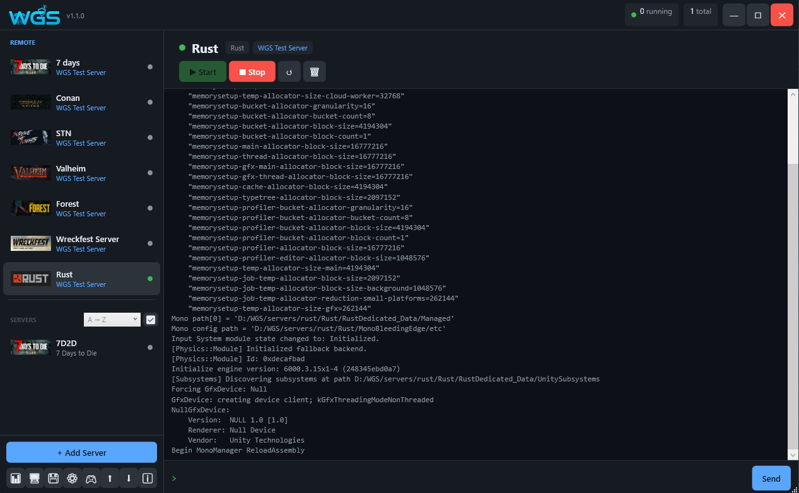

<div align="center">
  
  <h1>Windows Game Server</h1>
  <p><strong>Single-window management panel for Windows game servers</strong></p>

  
  
  
  
  
  

  🌐 **[wgsserver.com](https://wgsserver.com)** — website, full game list, installation guide & user manual

</div>

---

## What is Windows Game Server?

**Windows Game Server (WGS)** is a free, open-source desktop application that lets you host and manage dedicated game servers on any Windows PC — without touching the command line. It's a modern, actively maintained alternative to WindowsGSM, AMP (CubeCoders) and Pterodactyl Panel for anyone who wants a native Windows experience. See [wgsserver.com](https://wgsserver.com) for the full feature list, supported games, and documentation.

Instead of juggling SteamCMD scripts, batch files, Task Scheduler entries and manual firewall rules, WGS brings everything into one clean window:

- **Install** any supported game server in one click — SteamCMD is downloaded and run automatically in the background
- **Start, stop and restart** servers with a single button — or let WGS do it automatically after a crash, with smart crash-loop detection
- **Monitor** CPU and RAM usage per server in real time, with history graphs and a global system dashboard
- **Schedule** automatic restarts, updates and backups at any time of day or week
- **Back up** world saves and configs automatically before every update, with configurable retention
- **Send console commands** directly from the UI — no need to switch windows or open a terminal
- **Edit config files** for any server directly inside WGS, without opening a file manager
- **Install Workshop mods** and manage Oxide/Minecraft plugins from the same interface
- **Add any game** that isn't built-in using the graphical Plugin Creator — no coding required
- **Control servers remotely** via Discord bot commands or the built-in REST API
- **Manage firewall rules** automatically — WGS opens and closes the right ports when servers start and stop

WGS is designed for home lab hosts, small community server admins and anyone who wants a clean, reliable way to keep game servers running on Windows without spending time on maintenance.

Built with the help of AI coding tools, with every feature driven, tested and decided by the author.

---

## 📷 Screenshot

<p align="center">
  
</p>

---

> [!IMPORTANT]
> **Windows SmartScreen Warning:**
>
> Since WGS is an independent open-source tool that manages system-level tasks (Firewall, Process Priorities), Windows might show a "SmartScreen" warning.
> To run WGS: Right-click `WindowsGameServer.exe` → **Properties** → Check **Unblock** at the bottom → **OK**.

---

## ✨ Features

### Server management
| Feature | Description |
|---|---|
| 🎮 **101+ supported games** | Ready-made plugins for the most popular game servers |
| ⬇️ **SteamCMD integration** | Install and update servers with one click — SteamCMD downloaded automatically |
| 🔄 **Auto restart** | Automatic restart after crash, with configurable delay and crash loop detection |
| 🔁 **Auto-update** | Periodic SteamCMD updates on a configurable interval while the server runs |
| ⧉ **Server cloning** | Duplicate any server with all settings — ports assigned automatically |
| 💤 **Wake-on-demand** | Server starts automatically when the first player connects, saving resources when idle |
| 😴 **Shut down when empty** | Server stops automatically after a configurable idle timeout when all players leave |

### Monitoring
| Feature | Description |
|---|---|
| 📊 **System dashboard** | Global CPU, RAM and disk usage across all running servers |
| 📈 **Per-server performance charts** | CPU and RAM history graphs up to 1 hour, with selectable time range |
| 👥 **Player statistics** | Session tracking and total playtime per player, stored in SQLite |
| 📈 **Activity heatmap & top players** | Hourly activity chart (useful for scheduling restarts during quiet hours) and a most-active-players-in-30-days view |
| 🌐 **Bandwidth & connections** | Live network in/out and active connection count per server |
| ⚠️ **Crash prediction** | Warns before a likely crash from RAM growth, sustained high CPU or memory leaks — or switch to a simpler "low system memory only" mode with a configurable threshold |

### Automation
| Feature | Description |
|---|---|
| 🗓️ **Task scheduler** | Schedule start, stop, restart, update, backup, or a saved Quick Command — once, daily, weekly, or on a repeating "every X minutes/hours" interval |
| 💾 **Automatic backups** | Zip backups of world saves before updates, retention by count and/or age with a manual cleanup option, optional incremental backups for large worlds, selective backup paths per server — scheduled backups are skipped automatically if the server hasn't run in the last 24 hours |
| 🔗 **Group ban-list sync** | Ban a player on one server and it's automatically applied to every other running server in the same group (same game) — and replayed on group servers that were offline when the ban happened |
| 📋 **Shareable status page** | A read-only, no-login link per server showing live player count and uptime — safe to post in Discord or on a website |
| 📜 **Log-based crash detection** | Scans console output for known crash-precursor patterns (out-of-memory, fatal errors, access violations) in addition to the CPU/RAM heuristics |
| 📢 **Restart warnings** | Players get an in-game warning before daily, scheduled or auto-update restarts — works for Rust, Source-engine games, Minecraft, ARK, Palworld, DayZ and 7 Days to Die |

### Remote access
| Feature | Description |
|---|---|
| 📟 **RCON console** | Send commands to running servers via Source RCON protocol |
| 🤖 **Discord bot** | Control servers from any Discord channel: `!start`, `!stop`, `!restart`, `!update`, `!backup`, `!cmd` — plus an optional live status board with a "Wake" button, and admin control buttons on a separate restricted channel |
| 🌐 **REST API & web dashboard** | Built-in HTTP server for external integrations — start/stop/status/metrics/backup/restore endpoints, plus a sortable browser dashboard with a live per-server CPU graph |
| 🖥️ **Remote machine support** | Manage servers running on other PCs from a single master panel |

### Notifications
| Feature | Description |
|---|---|
| 🔔 **Discord webhooks** | Get notified on start, stop, crash, update and player join/leave events in Discord — global or per-server webhook URL |
| 📧 **Email notifications (SMTP)** | Receive the same alerts by email — configurable per server |

### Configuration & mods
| Feature | Description |
|---|---|
| 📝 **Config editor** | Browse and edit any server config file directly inside WGS, with automatic version history and one-click restore |
| 🗂️ **Steam Workshop** | Install and manage Workshop mods for supported games via SteamCMD, with a live title preview when entering an item ID |
| 📁 **File manager** | Browse, upload, download and delete server files without leaving WGS |

### System & extensibility
| Feature | Description |
|---|---|
| 🛡️ **Firewall management** | Windows Firewall rules opened/closed automatically on start and stop |
| 🧹 **Server hygiene** | Scans for and cleans up leftover log files, crash report folders and stray temp files while a server is stopped |
| âš¡ **Quick commands** | Save up to a handful of console command shortcuts (e.g. a welcome message) as one-click buttons |
| ⚙️ **CPU affinity, priority & RAM limit** | Per-server core pinning, process priority and hard RAM cap via Windows Job Objects |
| 🔧 **Custom Plugin Creator** | Graphical tool to add any game server — no code required, and remove ones you've created when you no longer need them |
| 📦 **Plugin import / export** | Share plugins as `.cs` files between machines |
| 🔔 **System tray** | Runs minimised in the background with tray notifications |
| 🔒 **Encrypted credentials** | Steam login and Discord tokens encrypted with Windows DPAPI |

---

## 🎮 Supported Games

101+ games supported out of the box — including Valheim, Rust, CS2, ARK, DayZ, Palworld, Minecraft, and many more.

👉 **[Full game list with search →](https://wgsserver.com/docs/games.html)**

The **Custom Plugin Creator** lets you add any other game server without touching code.

---

## 🖥️ Requirements

- **Windows 10 / Windows Server 2019** or newer
- **.NET 10 Runtime** — [download here](https://dotnet.microsoft.com/download/dotnet/10.0)
- **SteamCMD** — downloaded automatically on first install
- Administrator rights for firewall rule management

---

## 🚀 Installation

### Pre-built binary (recommended)

1. Download the latest release from the [Releases](../../releases) page
2. Extract the zip to a folder of your choice
3. Run `WindowsGameServer.exe`
4. If you get a .NET error, install the [.NET 10 Runtime](https://dotnet.microsoft.com/download/dotnet/10.0)

### Build from source

```bash
git clone https://github.com/MadBee71/WGS.git
cd WindowsGameServer/WGS
dotnet publish -c Release -o publish
```

> Requires [.NET 10 SDK](https://dotnet.microsoft.com/download/dotnet/10.0)

---

## 📦 Project structure

```
WGS/
├── Games/              # Game plugins (IGamePlugin interface)
│   ├── GamePluginBase.cs
│   ├── GameRegistry.cs
│   ├── ValheimPlugin.cs
│   ├── RustPlugin.cs
│   └── ...             # One .cs per game
├── Models/             # Data models (GameServer, ConsoleMessage...)
├── Services/           # Business logic and background services
├── ViewModels/         # MVVM ViewModels
├── Views/              # WPF XAML views
└── publish/            # Published executable output
```

---

## 🔌 Adding a custom plugin

### Graphical Plugin Creator

WGS includes a built-in Plugin Creator tool:
1. Open **Tools → Plugin Creator**
2. Fill in the game details (name, Steam AppID, executable, ports...)
3. Click **Save** — the plugin appears in the game list immediately

You can also export any plugin to a `.cs` file and share it, or import one from another machine via **Tools → Import Plugin**.

### Writing a plugin in code

Create a new file `Games/MyGamePlugin.cs`:

```csharp
using WGS.Games;
using WGS.Models;

public class MyGamePlugin : GamePluginBase
{
    public override string GameId            => "mygame";
    public override string GameName          => "My Game";
    public override string Description       => "Short description";
    public override string Category          => "Survival";
    public override int    SteamAppId        => 123456;
    public override string Executable        => "server.exe";
    public override int    DefaultPort       => 7777;
    public override int    DefaultQueryPort  => 27015;
    public override int    DefaultMaxPlayers => 32;

    public override string BuildStartArguments(GameServer s)
        => $"-port {s.ServerPort} -queryport {s.QueryPort} -maxplayers {s.MaxPlayers}";
}
```

Register it in `Games/GameRegistry.cs`:

```csharp
Register(new MyGamePlugin());
```

---

## 🏗️ Architecture

```
┌─────────────────────────────────────┐
│            WPF UI (XAML)            │
├──────────────┬──────────────────────┤
│  MainViewModel │  ServerViewModel   │  ← CommunityToolkit.Mvvm
├──────────────┴──────────────────────┤
│  ServerManagerService               │  ← Process lifecycle
│  SteamCmdService                    │  ← Install / update / Workshop
│  BackupService                      │  ← Zip backups + retention
│  FirewallService                    │  ← netsh / Windows Firewall COM
│  RconService                        │  ← Source RCON protocol
│  SystemMetricsService               │  ← Global CPU / RAM / disk
│  PerformanceMonitorService          │  ← Per-process CPU / RAM
│  PerfHistoryService                 │  ← Time-series chart data
│  PlayerStatsService                 │  ← Session tracking (SQLite)
│  ModManagerService                  │  ← Oxide / Minecraft plugins
│  SteamWorkshopService               │  ← Workshop item management
│  ConfigEditorService                │  ← In-app config file editing
│  ScheduledTaskService               │  ← Recurring automation tasks
│  NotificationService                │  ← Discord webhooks
│  DiscordBotService                  │  ← Discord bot (long-poll)
│  WebApiService                      │  ← REST API (HttpListener)
│  ServerGroupService                 │  ← Server grouping
└─────────────────────────────────────┘
         │
         â–¼
┌─────────────────────────────────────┐
│  IGamePlugin (per game)             │
│  GamePluginBase (defaults)          │
│  GameRegistry (registration)        │
└─────────────────────────────────────┘
```


---

## 🤝 Contributing

Pull requests are welcome! For large changes, please open an issue first to discuss what you'd like to change.

1. Fork this repository
2. Create a feature branch: `git checkout -b feature/my-new-feature`
3. Commit your changes: `git commit -m "Add: my new feature"`
4. Push: `git push origin feature/my-new-feature`
5. Open a Pull Request

---

## 📄 License

MIT License — see the [LICENSE](LICENSE) file.

---

## Support

The biggest help is completely free: if WGS is useful to you, **⭐ star this repo** — it's the main way other people find the project.

If you'd also like to chip in financially, that's entirely optional and never expected — it goes toward keeping development going, not "buying" features or support:

[](https://ko-fi.com/madbee71)

<div align="center">
  <sub>Built with .NET 10 · WPF · CommunityToolkit.Mvvm</sub>
</div>

